# System Architecture

Technical architecture and design decisions for the AI-generated fullstack Task Inbox application.

---

## Overview

A minimal full-stack CRUD application built entirely by an AI agent using the Ralph Loop pattern. The architecture prioritizes simplicity and testability to enable autonomous development.

---

## Technology Stack

| Component | Technology | Version | Purpose | Why Chosen |
|-----------|------------|---------|---------|------------|
| **Frontend** | React | 19.2.3 | UI library | Modern, component-based, AI-friendly |
| **Build Tool** | Vite | 7.3.1 | Dev server & bundler | Fast HMR, simple config |
| **Backend** | Express | 4.18.2 | HTTP server | Minimal, well-documented, standard |
| **Language** | TypeScript | 5.9.3 | Type safety | Reduces runtime errors, better AI code generation |
| **Testing** | Playwright | Latest | E2E testing | Reliable, cross-browser, clear API |
| **Package Manager** | pnpm | Latest | Dependency management | Fast, efficient, workspace support |

### Why This Stack?

**Optimized for AI Development**:
- Well-documented libraries (easier for AI to generate correct code)
- Simple, standard patterns (less ambiguity)
- Strong typing (catches errors at compile time)
- Minimal boilerplate (faster implementation)

---

## System Architecture

```mermaid
graph TB
    subgraph "Client (Port 5173)"
        Browser[🌐 Web Browser]
        React[⚛️ React App<br/>TaskList Component]
        State[📊 Local State<br/>Tasks Array]
    end

    subgraph "Server (Port 3000)"
        Express[🔌 Express Server<br/>CORS Enabled]
        Routes[🛣️ REST API<br/>CRUD Endpoints]
        Store[💾 In-Memory Store<br/>Tasks Map]
    end

    subgraph "Testing"
        Playwright[🧪 Playwright<br/>E2E Tests]
        TestBrowser[🖥️ Chromium<br/>Test Browser]
    end

    Browser --> React
    React --> State
    State -->|HTTP| Express
    Express --> Routes
    Routes --> Store

    Playwright --> TestBrowser
    TestBrowser -.->|Automate| Browser

    style React fill:#61dafb,stroke:#20232a,stroke-width:2px
    style Express fill:#68a063,stroke:#303030,stroke-width:2px
    style Playwright fill:#2ebd59,stroke:#2ebd59,stroke-width:2px
    style Store fill:#ff9800,stroke:#f57c00,stroke-width:2px
```



---

## Component Design

### Frontend Architecture

#### TaskList Component (Main Component)

```
src/
└── TaskList.tsx        # Single-file React component
    ├── State Management
    │   ├── tasks: Task[]              # All tasks
    │   ├── newTaskTitle: string       # Form input
    │   └── useEffect()                # Load on mount
    │
    ├── API Functions
    │   ├── fetchTasks()               # GET /api/tasks
    │   ├── handleSubmit()             # POST /api/tasks
    │   ├── handleComplete(id)         # PUT /api/tasks/:id
    │   └── handleDelete(id)           # DELETE /api/tasks/:id
    │
    └── Render
        ├── Input Form                 # Add new task
        ├── Task List                  # Display all tasks
        └── Task Item                  # Individual task with actions
```

**Key Decisions**:
- **Single Component**: Simplifies AI implementation (one file to generate)
- **Local State**: No external state management needed for simple app
- **Functional Component**: Modern React, hooks-based
- **Inline Styles**: Minimal CSS, all in one place

#### API Communication

```typescript
// All API calls use fetch with try-catch
const fetchTasks = async () => {
  try {
    const response = await fetch('http://localhost:3000/api/tasks');
    const data = await response.json();
    setTasks(data);
  } catch (error) {
    console.error('Failed to fetch tasks:', error);
  }
};
```

**Error Handling**: Console logs only (sufficient for demo)

---

### Backend Architecture

#### Express Server Structure

```
app/api/
├── src/
│   └── index.ts        # Single-file Express server
│       ├── CORS Setup
│       ├── JSON Parser
│       ├── Routes
│       │   ├── GET    /api/tasks
│       │   ├── POST   /api/tasks
│       │   ├── PUT    /api/tasks/:id
│       │   └── DELETE /api/tasks/:id
│       └── Storage
│           └── tasksStore: Map<string, Task>
│
├── package.json
└── tsconfig.json
```

#### Data Model

```typescript
interface Task {
  id: string;           // UUID v4
  title: string;        // Task description
  completed: boolean;   // Completion status
}
```

**Storage**: In-memory Map (resets on server restart)
- Simple for demo purposes
- No database setup required
- Enables autonomous AI development

#### API Endpoints

| Method | Endpoint | Request Body | Response | Purpose |
|--------|----------|--------------|----------|---------|
| **GET** | `/api/tasks` | - | `Task[]` | Fetch all tasks |
| **POST** | `/api/tasks` | `{ title: string }` | `Task` | Create new task |
| **PUT** | `/api/tasks/:id` | `{ completed: boolean }` | `Task` | Toggle completion |
| **DELETE** | `/api/tasks/:id` | - | `{ success: true }` | Delete task |

**CORS Configuration**:
```typescript
app.use(cors({
  origin: 'http://localhost:5173',  // Vite dev server
  credentials: true
}));
```

---

## Testing Strategy

### E2E Test Architecture

```
e2e/
├── tests/
│   └── tasks.spec.ts       # All 4 feature tests
├── playwright.config.ts    # Playwright configuration
└── package.json
```

#### Test Coverage

**4 Core Features, 4 Tests**:

1. **Create Task**
```typescript
test('should create a new task', async ({ page }) => {
  await page.goto('http://localhost:5173');
  await page.fill('input[type="text"]', 'Test Task');
  await page.click('button[type="submit"]');
  await expect(page.locator('text=Test Task')).toBeVisible();
});
```

2. **View Tasks**
```typescript
test('should display existing tasks', async ({ page }) => {
  // Pre-create task via API
  await page.goto('http://localhost:5173');
  await expect(page.locator('.task-item')).toHaveCount(1);
});
```

3. **Complete Task**
```typescript
test('should mark task as complete', async ({ page }) => {
  await page.goto('http://localhost:5173');
  await page.click('button:has-text("Complete")');
  await expect(page.locator('.completed')).toBeVisible();
});
```

4. **Delete Task**
```typescript
test('should delete a task', async ({ page }) => {
  await page.goto('http://localhost:5173');
  await page.click('button:has-text("Delete")');
  await expect(page.locator('.task-item')).toHaveCount(0);
});
```

#### Test Configuration

**Playwright Config**:
- **Browser**: Chromium (headless)
- **Timeout**: 30 seconds
- **Retries**: 2 (flaky test handling)
- **Base URL**: http://localhost:5173
- **Workers**: 1 (sequential execution)

**Why E2E Tests for Ralph Loop?**:
- Clear success criteria (pass/fail)
- Tests the entire application flow
- No unit test ambiguity
- Immediate feedback for AI agent

---

## Development Workflow

### Local Development

```mermaid
sequenceDiagram
    participant Dev as 👨‍💻 Developer
    participant Frontend as ⚛️ Frontend (5173)
    participant Backend as 🔌 Backend (3000)

    Dev->>Backend: pnpm dev (Terminal 1)
    Backend-->>Backend: Start on :3000
    Backend-->>Dev: ✅ Server running

    Dev->>Frontend: pnpm dev (Terminal 2)
    Frontend-->>Frontend: Start on :5173
    Frontend-->>Dev: ✅ App running

    Dev->>Frontend: Open http://localhost:5173
    Frontend->>Backend: API requests
    Backend-->>Frontend: JSON responses
```



**Dev Scripts**:
```bash
# Backend (app/api)
pnpm dev          # tsx watch src/index.ts

# Frontend (app/web)
pnpm dev          # vite

# Tests (e2e)
pnpm test         # playwright test
```

---

## AI Development Process

### How Ralph Loop Built This

```mermaid
flowchart TD
    Start([📋 Requirements<br/>docs/requirements.md]) --> Parse[🤖 AI Parses<br/>4 Features]

    Parse --> FE[💻 Generate Frontend<br/>React + TypeScript]
    Parse --> BE[🔌 Generate Backend<br/>Express + TypeScript]
    Parse --> Tests[🧪 Generate Tests<br/>Playwright E2E]

    FE --> Run[▶️ Start Servers]
    BE --> Run
    Tests --> TestRun[🧪 Run Tests]

    Run --> TestRun
    TestRun --> Check{All Pass?}

    Check -->|✅ Yes| Commit[📝 Git Commit<br/>+ Changelog]
    Check -->|❌ No| Fix[🔧 Debug & Fix]
    Fix --> Run

    Commit --> Done([✅ PROJECT_DONE])

    style Start fill:#e3f2fd,stroke:#2196f3,stroke-width:2px
    style Done fill:#e1f5e1,stroke:#4caf50,stroke-width:3px
    style Check fill:#fff3e0,stroke:#ff9800,stroke-width:2px
    style Commit fill:#f3e5f5,stroke:#9c27b0,stroke-width:2px
```



**Round 1 Implementation (5 minutes)**:

1. **Frontend** (2 min):
   - Generated `TaskList.tsx` with all CRUD UI
   - Added state management, API calls, event handlers
   - Styled with inline CSS

2. **Backend** (2 min):
   - Generated Express server with 4 endpoints
   - Implemented in-memory storage
   - Configured CORS

3. **Tests** (1 min):
   - Wrote 4 E2E tests covering all features
   - Configured Playwright
   - Verified all tests pass

**Why It Worked**:
- Clear requirements (4 features, well-defined)
- Standard stack (well-documented)
- Simple architecture (minimal complexity)
- Test-driven (clear success criteria)

---

## Design Decisions

### Why Single-File Components?

**Frontend**: One `TaskList.tsx` file
**Backend**: One `index.ts` file

**Rationale**:
- ✅ Easier for AI to generate in one go
- ✅ No file structure ambiguity
- ✅ Sufficient for small demo app
- ✅ Faster iteration

**Trade-off**: Wouldn't scale to production, but perfect for experiment.

### Why In-Memory Storage?

**No Database**:
- ✅ Zero setup required
- ✅ No connection string needed
- ✅ Enables pure autonomous development
- ✅ Sufficient for demo/testing

**Trade-off**: Data lost on restart, but acceptable for experiment.

### Why Express Over Other Frameworks?

**Alternatives Considered**:
- Next.js: More complex, server-side rendering overkill
- Fastify: Less familiar to AI, smaller ecosystem
- Koa: More modern but less documented

**Express Chosen**:
- Most documented (better AI code generation)
- Standard, minimal boilerplate
- Well-understood by developers

### Why TypeScript Over JavaScript?

**Benefits for AI Development**:
- Type checking catches errors at compile time
- Better IDE support for debugging
- More explicit contracts (interfaces)
- Reduces runtime surprises

**Cost**: Slightly more complex, but worth it for reliability.

---

## Performance Characteristics

| Metric | Value | Notes |
|--------|-------|-------|
| **Frontend Build** | ~2s | Vite is fast |
| **Backend Start** | <1s | Express lightweight |
| **Test Execution** | ~5s | 4 E2E tests |
| **Total Dev Setup** | ~10s | Install + start |
| **API Response Time** | <10ms | In-memory storage |

**Scalability**: Not designed for scale (in-memory storage), designed for demonstration.

---

## Deployment Considerations

### Current State: Local Development Only

**Not Production-Ready**:
- In-memory storage (data loss on restart)
- No authentication
- No error handling (beyond console.log)
- No logging
- No monitoring

### If Deploying to Production

**Would Need**:
1. **Database**: PostgreSQL or MongoDB
2. **Authentication**: JWT or session-based
3. **Error Handling**: Proper error responses
4. **Logging**: Winston or Pino
5. **Environment Config**: .env files
6. **Deployment**: Docker + cloud hosting

**But That's Not the Point**: This is an **experiment in AI development**, not a production application.

---

## Security Considerations

### Current Implementation

**No Security** (intentionally):
- No authentication
- No authorization
- No input validation
- No rate limiting
- No XSS protection

**Rationale**: Security is out of scope for this Ralph Loop experiment. Focus is on autonomous AI development capability, not production readiness.

### If Security Required

Would need:
```typescript
// Input validation
import { z } from 'zod';
const taskSchema = z.object({
  title: z.string().min(1).max(200)
});

// Authentication
import jwt from 'jsonwebtoken';
const authMiddleware = (req, res, next) => {
  // Verify JWT token
};

// Rate limiting
import rateLimit from 'express-rate-limit';
const limiter = rateLimit({ windowMs: 15 * 60 * 1000, max: 100 });
```

---

## Future Enhancements (If Continuing)

### v2.0 Potential Features

1. **Persistence**:
   - SQLite or PostgreSQL
   - Prisma ORM
   - Database migrations

2. **Authentication**:
   - User accounts
   - JWT tokens
   - Session management

3. **Advanced Features**:
   - Task due dates
   - Task priorities
   - Task categories
   - Search and filter

4. **UI Improvements**:
   - Drag-and-drop reordering
   - Animations
   - Dark mode
   - Mobile responsive

**But Remember**: The goal was to prove Ralph Loop works, not to build a production app. Mission accomplished in Round 1.

---

## Lessons for AI-Generated Architecture

### What Worked Well

1. **Simple Stack**: Standard, well-documented technologies
2. **Minimal Abstraction**: Single-file components
3. **Clear Contracts**: TypeScript interfaces
4. **Test-Driven**: E2E tests as acceptance criteria

### What to Avoid

1. **Complex Frameworks**: Next.js, NestJS add unnecessary complexity
2. **Novel Patterns**: AI struggles with non-standard architectures
3. **Ambiguous Requirements**: Must be specific
4. **Interactive Setup**: Databases, auth require manual config

### Recommendations for Next AI Project

```markdown
✅ DO:
- Use standard, well-documented tech stacks
- Keep architecture simple (single files when possible)
- Write E2E tests as success criteria
- Avoid interactive setup steps

❌ DON'T:
- Choose cutting-edge or poorly documented tools
- Over-engineer with abstractions
- Require manual configuration
- Use novel architectural patterns
```

---

## Conclusion

This architecture demonstrates that **AI agents can autonomously build complete, working full-stack applications** when given:

1. Clear requirements
2. Simple, standard tech stack
3. Test-driven success criteria
4. No interactive setup steps

**The simplicity is intentional and proves the concept.** More complex architectures are possible, but this minimal design achieved 100% success in Round 1, which was the goal.

---

**Related Documentation**:
- [Workflow Diagrams](./WORKFLOW_DIAGRAMS.md) - Visual process flows
- [Ralph Loop Improvements](./ralph-loop-improvements.md) - Lessons learned
- [Requirements](./requirements.md) - Original feature specifications
- [Retrospective](./retrospective.md) - Post-experiment analysis
