# Workflow Diagrams - Ralph Loop Experiment

Visual representations of the AI-driven development process using the Ralph Loop pattern.

---

## 1. Ralph Loop Cycle

The core iterative pattern for autonomous AI development:

```mermaid
graph LR
    Start([🎯 Requirements]) --> Implement[💻 Implement<br/>Features]
    Implement --> Test[🧪 Run Tests<br/>E2E Verification]
    Test --> Pass{Tests<br/>Pass?}

    Pass -->|✅ Yes| Commit[📝 Git Commit<br/>+ Changelog]
    Pass -->|❌ No| Debug[🔍 Debug<br/>& Fix]
    Debug --> Implement

    Commit --> Complete{All<br/>Complete?}
    Complete -->|No| Implement
    Complete -->|Yes| Done([✅ PROJECT_DONE])

    style Start fill:#e1f5e1,stroke:#4caf50,stroke-width:3px
    style Done fill:#e1f5e1,stroke:#4caf50,stroke-width:3px
    style Test fill:#e3f2fd,stroke:#2196f3,stroke-width:2px
    style Pass fill:#fff3e0,stroke:#ff9800,stroke-width:2px
    style Complete fill:#fff3e0,stroke:#ff9800,stroke-width:2px
    style Commit fill:#f3e5f5,stroke:#9c27b0,stroke-width:2px
```

**Key Characteristics**:
- **Autonomous**: No human intervention required
- **Test-Driven**: Tests define success criteria
- **Iterative**: Repeat until all requirements met
- **Self-Documenting**: Automatic changelog generation

---

## 2. Experiment Timeline (8 Rounds)

Actual development timeline showing both successes and failures:

**Round Breakdown**:
- **Round 1** (5 min): ✅ Perfect - All features + tests passing
- **Rounds 2-4** (10 min): ❌ Failed - Git push authentication issues
- **Round 5** (2 min): ⚠️ Config fix - Set `completion_promise`
- **Rounds 6-8** (3 min): ⚠️ Wasted - Loop exit detection problems

**Total Time**: 20 minutes
**Effective Time**: 5 minutes (only Round 1 productive)
**Efficiency**: 25% (should have been 1-2 rounds)

---

## 3. Test-Driven Development Flow

How E2E tests guided the development process:

```mermaid
sequenceDiagram
    participant Agent as 🤖 AI Agent
    participant Code as 💻 Codebase
    participant Tests as 🧪 E2E Tests
    participant Git as 📝 Git

    Agent->>Code: Implement Create Task
    Agent->>Code: Implement View Tasks
    Agent->>Code: Implement Complete Task
    Agent->>Code: Implement Delete Task

    Agent->>Tests: Run Playwright E2E
    Tests->>Tests: ✓ Create task test
    Tests->>Tests: ✓ View tasks test
    Tests->>Tests: ✓ Complete task test
    Tests->>Tests: ✓ Delete task test

    Tests-->>Agent: ✅ All 4 Tests Passing

    Agent->>Git: git add .
    Agent->>Git: git commit -m "feat: implement all CRUD"
    Agent->>Git: Generate changelog

    Git-->>Agent: ✅ Committed

    Note over Agent,Git: Round 1 Complete (5 minutes)
```

**Success Factors**:
- Clear test specifications
- E2E tests as acceptance criteria
- Immediate feedback loop
- No ambiguity in requirements

---

## 4. System Architecture

Full-stack application structure with AI-generated code:

```mermaid
graph TB
    subgraph "Frontend (React + Vite)"
        UI[🎨 UI Components<br/>Task List, Form, Items]
        State[📊 State Management<br/>Local State + API Calls]
    end

    subgraph "Backend (Express + TypeScript)"
        API[🔌 REST API<br/>CRUD Endpoints]
        Store[💾 In-Memory Store<br/>Task Storage]
    end

    subgraph "Testing (Playwright)"
        E2E[🧪 E2E Tests<br/>4 Feature Tests]
        Runner[⚙️ Test Runner<br/>Playwright]
    end

    subgraph "AI Agent (Claude)"
        Ralph[🤖 Ralph Loop<br/>Autonomous Development]
    end

    UI --> State
    State -->|HTTP Requests| API
    API --> Store

    E2E --> UI
    E2E --> API
    Runner --> E2E

    Ralph -.->|Implements| UI
    Ralph -.->|Implements| State
    Ralph -.->|Implements| API
    Ralph -.->|Implements| Store
    Ralph -.->|Writes| E2E
    Ralph -->|Runs| Runner

    style UI fill:#e3f2fd,stroke:#2196f3
    style State fill:#e3f2fd,stroke:#2196f3
    style API fill:#f3e5f5,stroke:#9c27b0
    style Store fill:#f3e5f5,stroke:#9c27b0
    style E2E fill:#e8f5e9,stroke:#4caf50
    style Runner fill:#e8f5e9,stroke:#4caf50
    style Ralph fill:#fff3e0,stroke:#ff9800,stroke-width:3px
```

**Technology Stack**:
- **Frontend**: React 19 + TypeScript + Vite
- **Backend**: Express + TypeScript
- **Testing**: Playwright E2E
- **Package Manager**: pnpm
- **AI**: Claude (Sonnet)

---

## 5. Success vs Failure Decision Tree

What worked and what didn't in the experiment:

```mermaid
graph TD
    Start([Ralph Loop<br/>Experiment]) --> R1{Round 1<br/>Development}

    R1 -->|✅| Features[All Features<br/>Implemented]
    Features --> Tests[All Tests<br/>Passing]
    Tests --> Should1[Should Exit]

    R1 -->|Config| Problem1[❌ completion_promise<br/>= null]
    Problem1 --> NoExit1[Agent Doesn't Exit]

    NoExit1 --> R2{Round 2-4<br/>Git Push}
    R2 -->|❌| Auth[Authentication<br/>Required]
    Auth --> SSH[Try SSH Keys]
    SSH --> HTTPS[Try HTTPS Token]
    HTTPS --> GH[Try GitHub CLI]
    GH --> Fail[All Methods Fail]

    Fail --> R5{Round 5<br/>Config Fix}
    R5 -->|✅| SetPromise[Set completion_promise<br/>= PROJECT_DONE]
    SetPromise --> R6{Round 6-8<br/>Exit Detection}

    R6 -->|❌| NoCheck[No Auto-Completion<br/>Checker]
    NoCheck --> Repeat[Agent Repeats<br/>Same Checks]
    Repeat --> Manual[Manual Stop]

    Should1 -.->|Ideal Path| Exit([✅ Exit After<br/>Round 1])
    Manual -.->|Actual Path| Exit2([⚠️ Exit After<br/>Round 8])

    style Start fill:#e1f5e1,stroke:#4caf50,stroke-width:3px
    style Exit fill:#e1f5e1,stroke:#4caf50,stroke-width:3px
    style Exit2 fill:#fff3e0,stroke:#ff9800,stroke-width:3px
    style Features fill:#e8f5e9,stroke:#4caf50
    style Tests fill:#e8f5e9,stroke:#4caf50
    style Problem1 fill:#ffebee,stroke:#f44336
    style Auth fill:#ffebee,stroke:#f44336
    style Fail fill:#ffebee,stroke:#f44336
    style NoCheck fill:#ffebee,stroke:#f44336
```

**Key Learnings**:
1. ✅ **What Worked**: Test-driven development, clear requirements, E2E verification
2. ❌ **What Failed**: Configuration, interactive requirements, exit detection
3. 💡 **Solution**: Set `completion_promise` from start, avoid auth-required tasks, add auto-checkers

---

## 6. Ideal vs Actual Workflow Comparison

Side-by-side comparison of expected vs actual execution:

```mermaid
graph LR
    subgraph "Ideal Workflow (Expected)"
        I1([Start]) --> I2[Round 1:<br/>Implement + Test]
        I2 --> I3{All Pass?}
        I3 -->|✅| I4[Commit]
        I4 --> I5([PROJECT_DONE])
    end

    subgraph "Actual Workflow (Happened)"
        A1([Start]) --> A2[Round 1:<br/>Implement + Test ✅]
        A2 --> A3[Round 2-4:<br/>Git Push ❌]
        A3 --> A4[Round 5:<br/>Fix Config ⚠️]
        A4 --> A5[Round 6-8:<br/>Exit Loop ⚠️]
        A5 --> A6([Manual Stop])
    end

    style I1 fill:#e1f5e1,stroke:#4caf50,stroke-width:2px
    style I5 fill:#e1f5e1,stroke:#4caf50,stroke-width:2px
    style A1 fill:#e1f5e1,stroke:#4caf50,stroke-width:2px
    style A2 fill:#e8f5e9,stroke:#4caf50
    style A3 fill:#ffebee,stroke:#f44336
    style A4 fill:#fff3e0,stroke:#ff9800
    style A5 fill:#fff3e0,stroke:#ff9800
    style A6 fill:#fff3e0,stroke:#ff9800,stroke-width:2px
```

**Efficiency Analysis**:
- **Ideal**: 1 round, 5 minutes
- **Actual**: 8 rounds, 20 minutes
- **Overhead**: 7 rounds, 15 minutes (75% wasted)

**Root Causes**:
1. Configuration not set upfront (`completion_promise: null`)
2. Requirement included interactive task (`git push`)
3. No automatic completion verification script

---

## 7. Configuration Impact

How proper configuration changes the outcome:

**Configuration Checklist**:
- ✅ Set `completion_promise` from start
- ✅ Avoid interactive/auth requirements
- ✅ Create auto-completion checker script
- ✅ Provide clear exit instructions
- ✅ Use test results as completion criteria

---

## Summary

These diagrams illustrate the complete Ralph Loop experiment, showing:

1. **The Pattern**: Iterative AI development cycle
2. **The Reality**: 8 rounds with 7 wasted on configuration issues
3. **The Process**: Test-driven development with E2E verification
4. **The Architecture**: Full-stack application structure
5. **The Analysis**: Success/failure decision points
6. **The Comparison**: Ideal vs actual workflow
7. **The Solution**: Proper configuration to achieve ideal workflow

**Key Takeaway**: With proper configuration, Ralph Loop can achieve **perfect autonomous development in 1-2 rounds**. This experiment proves the concept while documenting the pitfalls to avoid.

---

**Related Documentation**:
- [Architecture Details](./ARCHITECTURE.md)
- [Ralph Loop Improvements](./ralph-loop-improvements.md)
- [Experiment Retrospective](./retrospective.md)
- [Development Changelog](./changelog.md)
